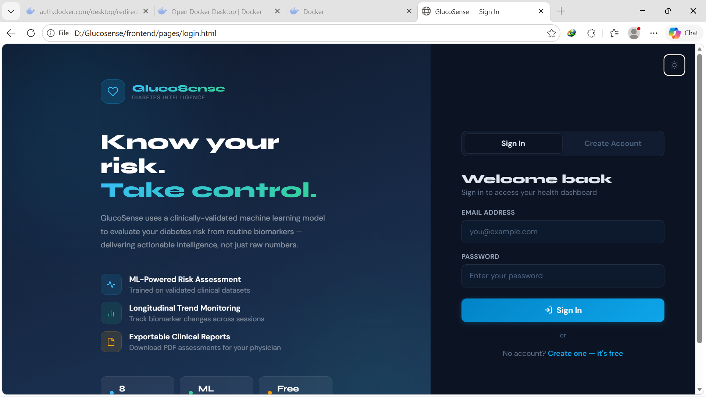
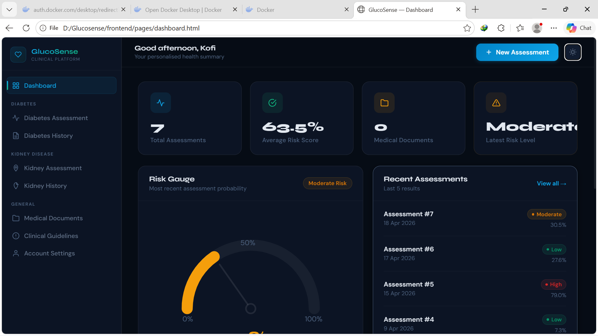
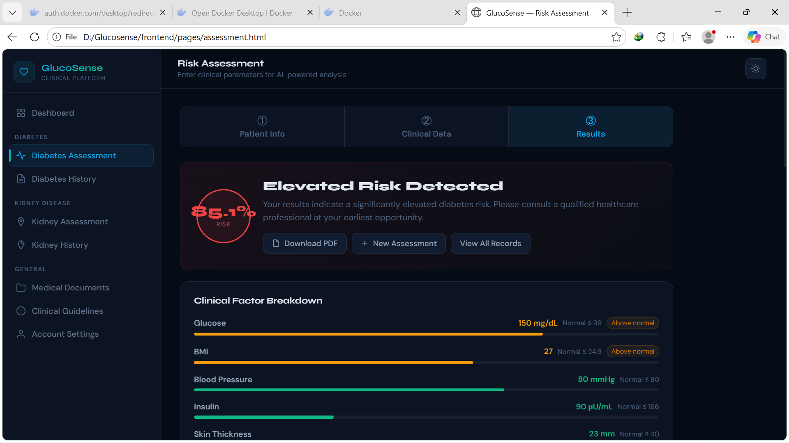
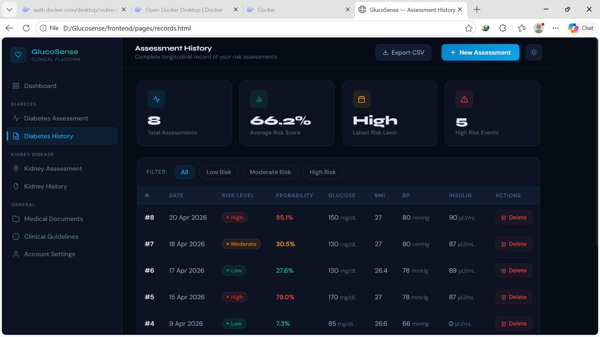
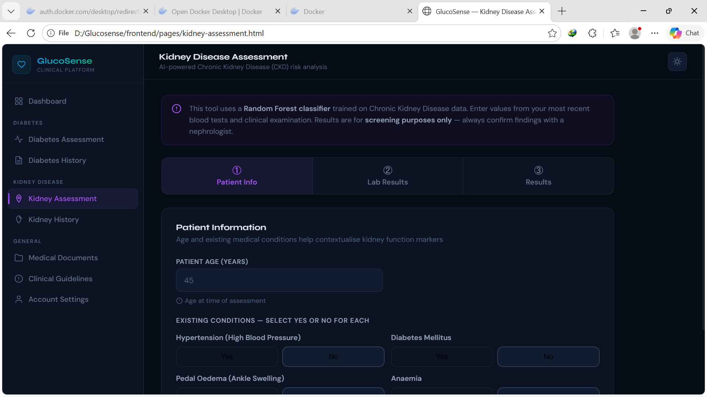
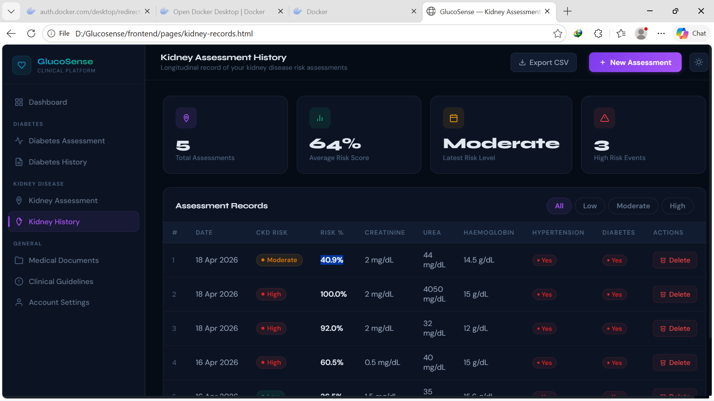
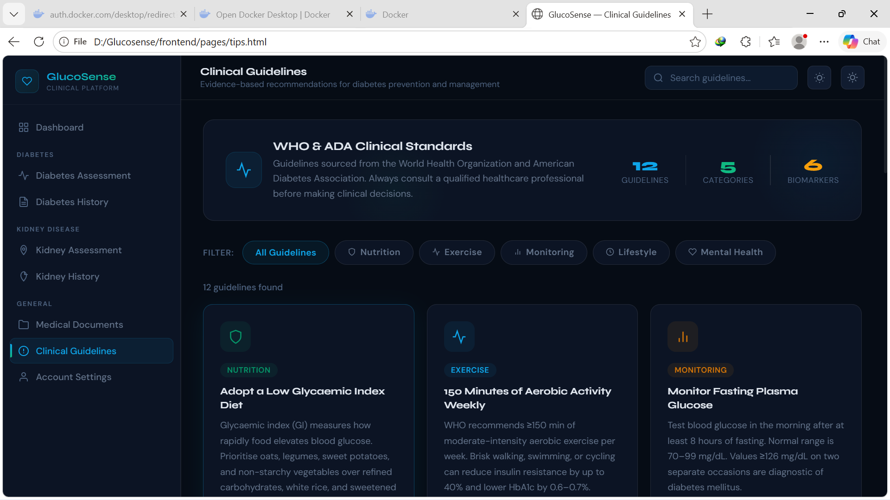
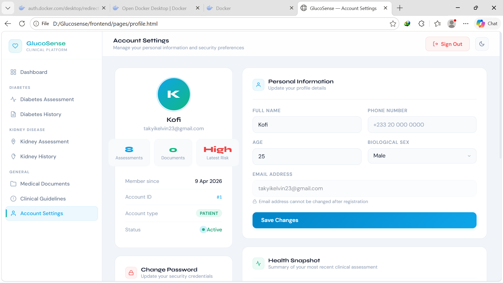

# Glucosense

**A machine learning web application that predicts the risk of diabetes and chronic kidney disease from patient health data.**

Glucosense is a full-stack health-screening tool that combines trained classification models with a clean web interface, giving users quick, private risk estimates they can share with a clinician.

> **Disclaimer:** Glucosense is a personal portfolio project built for educational purposes. It is not a medical device and must not be used for actual diagnosis or treatment decisions. Always consult a qualified healthcare professional.

---

## Screenshots

| Login | Dashboard |
|-------|-----------|
|  |  |

| Diabetes Assessment | Diabetes History |
|---------------------|------------------|
|  |  |

| Kidney Assessment | Kidney History |
|-------------------|----------------|
|  |  |

| Clinical Guidelines | Light Mode |
|---------------------|------------|
|  |  |

---

## Features

- **Diabetes risk prediction** using a Logistic Regression classifier trained on the Pima Indians Diabetes Dataset.
- **Chronic kidney disease prediction** using a Random Forest classifier.
- **User authentication** - secure signup, login, and personal session management.
- **Personal health records** - users can save past assessments and track them over time.
- **Clinical guidelines reference** - built-in reference for the metrics used in predictions.
- **Downloadable reports** - assessment results can be exported for sharing with clinicians.
- **Light and dark themes** - full theming support across the UI.
- **Responsive web UI** - built with plain HTML, CSS, and JavaScript for fast load times and easy maintenance.

---

## Model Performance

| Disease | Model | Accuracy | Dataset |
|---------|-------|----------|---------|
| Diabetes | Logistic Regression | **~80%** | Pima Indians Diabetes Dataset |
| Chronic Kidney Disease | Random Forest | **~96%** | UCI Chronic Kidney Disease Dataset |

Models were evaluated using an 80/20 train/test split with accuracy, confusion matrix, and classification reports.

---

## Tech Stack

**Backend**
- Python 3.11
- Flask (REST API)
- Scikit-learn (model training and inference)
- Pandas, NumPy (data processing)
- SQLAlchemy (database ORM)

**Frontend**
- HTML5, CSS3, Vanilla JavaScript
- Fetch API for backend communication

**Machine Learning**
- Logistic Regression (diabetes)
- Random Forest (kidney disease)
- Pickle for model serialization

---

## Getting Started

### Prerequisites
- Python 3.11 or later
- A modern web browser
- Git

### 1. Clone the repository
    git clone https://github.com/kofi-takyi-agyeman/glucosense.git
    cd glucosense

### 2. Set up the backend
    cd backend
    python -m venv venv
    venv\Scripts\activate
    pip install -r requirements.txt

### 3. Configure environment variables
    cp .env.example .env

### 4. Train the models (if model.pkl is missing)
    python train_model.py
    python train_kidney_model.py

### 5. Run the backend
    python app.py

The API will be available at http://localhost:5000.

### 6. Run the frontend
Open frontend/index.html directly in your browser, or serve it with a simple HTTP server:

    cd frontend
    python -m http.server 8080

Then visit http://localhost:8080.

---

## API Overview

| Endpoint | Method | Description |
|----------|--------|-------------|
| /auth/signup | POST | Register a new user |
| /auth/login | POST | Authenticate a user |
| /predict | POST | Predict diabetes risk |
| /kidney/predict | POST | Predict kidney disease risk |
| /records | GET | List user's saved assessments |
| /reports | GET | Generate downloadable report |

---

## Roadmap

- [ ] Deploy live demo on Render
- [ ] Add unit tests for prediction endpoints
- [ ] Expand to a third disease (heart disease)
- [ ] Mobile-responsive UI improvements
- [ ] Containerize with Docker
- [ ] Replace pickle serialization with a safer format (joblib / ONNX)

---

## License

This project is licensed under the MIT License - see the LICENSE file for details.

---

## Author

**Kofi Takyi Agyeman**
Mobile and Machine Learning Engineer, Accra, Ghana

- GitHub: @kofi-takyi-agyeman (https://github.com/kofi-takyi-agyeman)
- Email: takyikelvin23@gmail.com